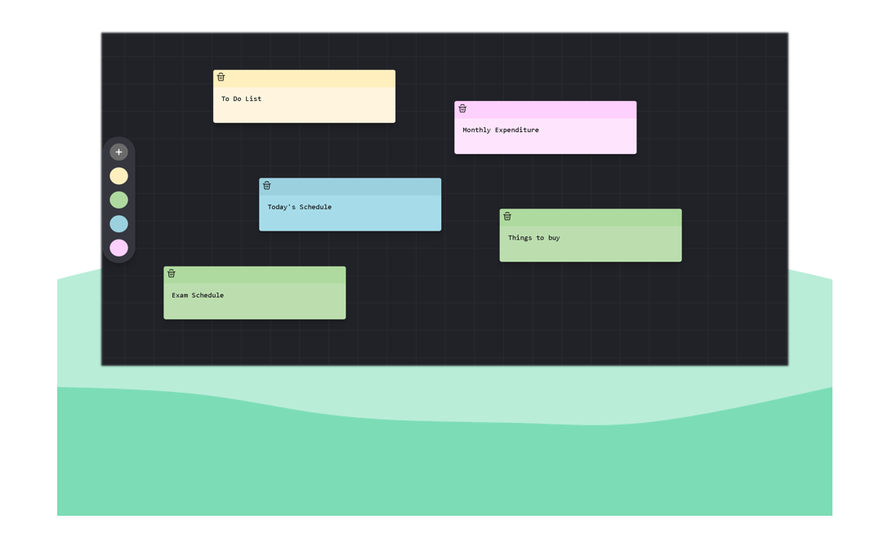

<div align="center">

  

  <h1>Quick Notes</h1>

  <h3>
    <a href="https://quicknotes-gamma.vercel.app/">
      <strong>Live Site</strong>
    </a>
  </h3>

  <div align="center">
    <a href="https://quicknotes-gamma.vercel.app/">View website</a>
    •
    <a href="https://github.com/hydraharish123/QuickNotes/issues">Report Bug</a>
    •
    <a href="https://github.com/hydraharish123/QuickNotes/pulls">Request Feature</a>
  </div>

  <hr>

</div>

<!-- Badges -->
<div align="center">


[](www.linkedin.com/in/psharish27)


</div>

<!-- Brief -->
<p align="center">
Welcome to <b>Quick Notes</b>! This is a simple and intuitive sticky notes app that lets you create, customize, and organize notes effortlessly. Perfect for brainstorming, to-dos, and quick reminders!
</p>

<!-- Screenshot -->
<a align="center" href="https://the-wild-oasis-alamin.vercel.app">



</a>

## Live Site

Check out the live app here: [QuickNotes](https://quicknotes-gamma.vercel.app/)


## Key Features

- **Drag & Drop** – Easily move notes around the board for better organization.
- **Customizable Colors** – Assign different colors to notes for easy categorization.
- **Automatic resizable Notes** – note size is adjusted depending on the size of the content.
- **Sticky Board Layout** – Keep all your notes visible in a flexible, freeform workspace.
- **Auto-Save** – Never lose your notes with automatic saving.
- **Collaboration (Future Feature)** – Share and edit notes with others in real time.

## Technologies Used

- **React** for the frontend.
- **React Router** for navigation.
- **Appwrite** for storying and querying notes
- **TailwindCSS** for styling the UI.
- **Vite** for development environment and build system.

## What I Learned

This project was a deep dive into some of the most fundamental concepts, including:

- **Querying and storing:** Implementing Appwrite to securely manage user notes.
- **Real-time Functionality:** Leveraging Appwrite's real-time features for dynamic data updates.

## Setup Instructions

To run this project locally:

1. Clone the repo:
   ```bash
   git clone https://github.com/hydraharish123/QuickNotes.git
   ```
2. Install dependencies:
   ```bash
   npm install
   ```
3. Set up environment variables:
   - Configure Supabase and add the necessary environment variables in a `.env` file. Check out the `.env.example` for reference.
4. Run the development server:
   ```bash
   npm run dev
   ```
5. Open [http://localhost:3000](http://localhost:3000) to see the app.

## Author

<b>👤 P S Harish</b>


Feel free to contact me with any questions or feedback!

